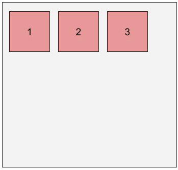
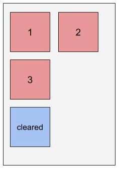

# HTML & CSS Layout

## Instructions

-   Fork and clone this repository
-   Run `npm install` to install dependencies

## Objectives

Students should, at the end of the lesson, be able to:

-   Establish spacing inside and outside of elements using margin and padding.
-   Explain the difference between different types of distance measurement in a web
page, including 'px', '%', and 'em'.
-   Use 'float' and 'clear' to stack elements alongside each other.
-   Employ media queries to change CSS rules based on screen size.
-   Explain the difference between 'static' and 'fixed' positioning.

### Basic CSS Positioning

So far, we've mostly talked about using CSS for styling our page - adding colors, fonts, etc. Next, we'll be examining how CSS can be used to control a webpage's layout.

Back in the 90s, layout was accomplished using tables (`<table>`), which had rows (`<tr>`) and row subdivisions (`<td>`). However, this was problematic for several reasons:

1.  Layout was hard-coded into the page - it couldn't easily be adjusted.
2.  As a result of (1), keeping layout consistent between multiple pages was
tedious.
3.  Nesting tables within tables quickly became a nightmare; how could you tell
 apart the `<tr>` of one level from the `<td>` of another?
4.  It wasn't very semantic - our markup would always say 'table', even though our
content was typically not a table.

Using CSS to control our layout addressed all of these issues. What's more, it
effectively abstracted away the _layout_ of our page from the _content_ of our
page.

#### Dimensions - Box Model

In addition to setting an element's `height` and `width`, elements have three
other properties that explicitly control spacing:

1.  'Border' sets a perimeter around an element. In addition to specifying a color
and a particular type of border, you can also specify a thickness.
2.  'Margin' specifies spacing between the outside of an element's border and any
adjacent elements.
3.  'Padding' specifies spacing between the inside of an element's border and the
contents of that element (which includes `height` and `width`!)

Together, these attributes form _the box model_, a way of describing the space
taken up by an element.

_Note: an element's size is determined by its content's height and width.Border, margin, and padding add to that size._
_To calculate those into the element's size, the element's CSS [`box-sizing`](https://developer.mozilla.org/en-US/docs/Web/CSS/box-sizing) property should be changed from the default `content-box` to `border-box.`_


Every one of these attributes, including `height` and `width`, can be specified
in the following terms:
-   `px` : fixed number of pixels
-   `%`  : size is relative to element that contains it ("parent"). As a value of
`height`, `%` is relative to the parent's `height`, but for every other
dimension, `%` is relative to the parent's `width` value.
-   `em` : ties dimensions to *font size* - one `em` is the width of the letter 'm'.
For all dimensions except `font-size`, `em` will refer to the font size of the
element; as a value for `font-size`, `em` refers to the font size of the
*parent*

#### Float and Clear

Block elements, as a rule, always stack vertically - never side by side. Each
block element effectively has a 'new-line' built into it, forcing the next piece
of content down.


This can be circumvented using the `float` property; floated elements act like
words within a block of text, wrapping around the screen when it is too narrow
to display the entire line.




Like words, floated elements can be stacked from left-to-right (_left-floated_)
or from right-to-left (_right-floated_)

To make something fall beneath a set of floated elements, rather then wrapping
around it, you can use the `clear` attribute; set clear to `left` to clear a
`left` float, `right` to clear a `right` float, or `both` to clear either kind
of float.



> Ordinarily, elements expand to hold their containers. However, floated
> elements are excluded from this, so floating an element may lead to its
> container's height shrinking down to nothing. To fix this, we use a "cleafix
> hack" by applying `overflow: hidden;` to the container's style declarations.

#### Your Turn : Basic Positioning (Dimensions, Float/Clear)

In your squads, create simple look-alikes that mimic the layout (but **not** the
actual content) of one of the following sites, using what you've learned about
so far about CSS positioning (including margin, padding, float and clear).

-   [Boston Globe](http://bostonglobe.com)
-   [Wikipedia](http://en.wikipedia.org/wiki/Main_Page)
-   [Reddit](http://reddit.com)

> Hint: Start by drawing a sketch, and breaking up the content of the page into
nested boxes!

### Advanced CSS Positioning

#### Media Queries
Using `%` dimensions allows you, to a certain degree, to account for a variety
of screen sizes by scaling up linearly. Sometimes, however, you don't want to
scale linearly; instead you want size to be fixed sometimes, to scale linearly
at others, or even to disappear entirely at a certain size.

Fortunately, CSS has a tool called a **media query** designed for this specific
use case.

```css
@media (max-width: 700px) {
  div {
    width: 300px;
    height: 300px;
  }
}
```

A media query acts a little like an `if` statement for your CSS; it will
_selectively hide or show_ the CSS it contains based on whether or not the
condition in the query comes back as `true`.

Media queries can often be thought of blocks of CSS that override existing
styles from your stylesheet (although they can do much more than this). They,
therefore, are always placed at the bottom of your stylesheet.

Here are some properties that can be used to build media queries:

-   min-width : CSS is visible at all screen widths **larger** than the given value.
-   max-width: CSS is visible at all screen widths **smaller** than the given value.
-   min/max-resolution :  CSS is visible above/below a given resolution.

In addition to hiding/showing sections of CSS code, media queries can even be
used to selectively load or not load _entire stylesheets_!

```html
<link rel="stylesheet" media="(max-width: 800px)" href="example.css" />
```

#### Your Turn : Media Queries

Revisit the basic site from the previous exercise, and add a new effect
that triggers when you shrink the screen below 800px wide.

### Static vs Fixed Positioning

All of the rules that you've learn so far are based on one paradigm of
positioning, called 'static' positioning. However, it's possible to change this
paradigm and employ a different approach for positining elements using the
`position` attribute.

Though there are others, the most significant type of positioning besides
`static` positioning is `fixed` positioning. `fixed` positioning defines the
position of an element with respect to the *view window*, essentially 'fixing'
its position on the screen. Fixed positioning is frequently used in parallax
scrolling, or for holding a navigation bar at the top/side/bottom of the screen.

```css
.bar {
position: fixed;
  left: 130px;
}
```

#### Your Turn : Static vs Fixed Positioning

As in the previous exercise, work in your squads to create your own look-alike
for the following websites; however, this time, try to use fixed positioning at
least once.

-   [You Tube](https://youtube.com)
-   [Twitter](https://twitter.com/GA)
-   [Artisan Asylum](http://artisansasylum.com/)
